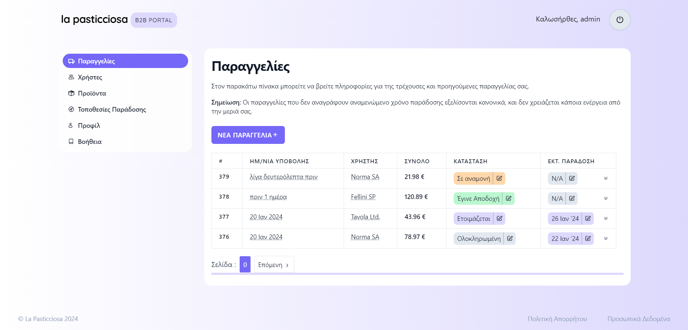
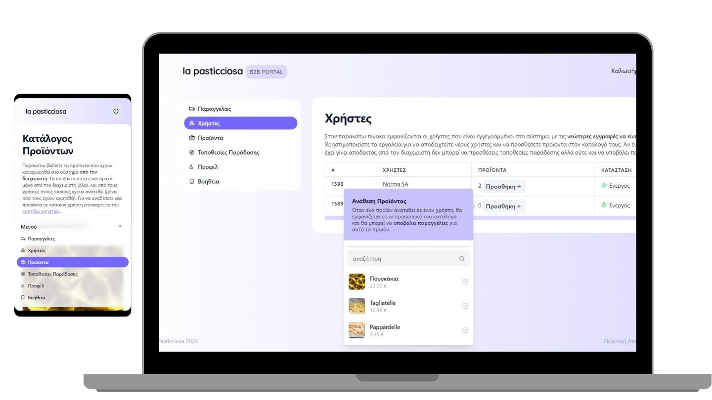
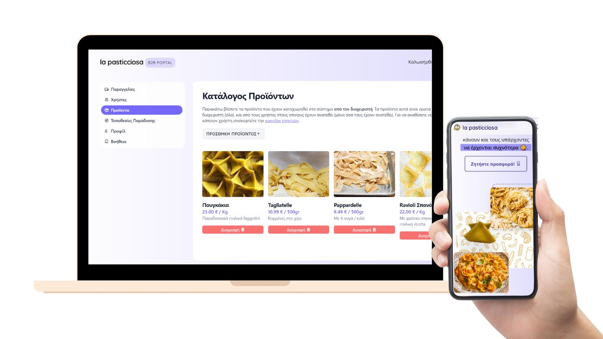

# 👩‍💻 La Pasticciosa B2B CRM: business automation and growth with a custom CRM!

Custom B2B CRM developed for a fresh pasta lab. Achievements; stramlined operations, efficient customer management, and accelerated business growth! [Check out the live result!](https://b2b.lapasticciosa.gr)

## 🚀 Features That Might Interest You:

### Custom Customer Vetting Procedures 🧐

- **Exclusive Validation:** Tailored vetting procedures ensure that your business engages with only the most delectable clients.
- **Compartmentalized Data:** Each user is concerned and has access to the information relevant to their level of priviledge.

### Intuitive User Interface 🎨

- **Simplicity at its Best:** The UI is as smooth as al dente pasta, providing a user-friendly experience for _single-step order placement_.
- **Anytime, Anywhere Access:** Responsive design lets you manage your inventory from the kitchen, the office, or on the go.

### Reporting and Analytics 📈

- **Data Delights:** Turn data into money with built-in reporting tools for informed business decisions.
- **Your Recipe, Your Reports:** Customize reports to your business flavor, revealing insights into customer tastes and market trends.

## ☔ Under the hood:

1. **Backend:** TypeORM powered backend fueled by PostgressSQL CockroachDB. Typesafe _remote procedure calling_ developed with tRPC. ExpressJS server running on Firebase Functions instances.

2. **Frontend:** Personalized UI developed with TailwindCSS powered by VueJS as a SPA. 3D graphics created with SplineJS.

3. **CDN:** Static asset hosting and delivery through Firebase Hosting.

4. **Natural Language (WIP):** Order parsing with Google's `bison-chat@latest` model. Data retrieval through a mixture of elastic and PaLM embeddings.

## 🌟 Experimental Features `WIP`

1. **Generative AI Chatbot:** Transition customers to online order placements through a hybrid chat-bot experiences available through SMS, Viber and WhatsAPP channels.

2. **3D Presentations:** Guide prospective clients through the process of pasta making via a custom 3D landing page experience. [Read more about how I plan on developing this with the help of Spline 3D and Stable Diffusion XL](https://medium.com/@theoanastasiadis98).

## 📜 Further Enquiries

La Pasticciosa B2B CRM is served under the [MIT License](LICENSE.md). Your ticket to further CRM developement is just a `git clone` away!

### Teo Anastasiadis 👩‍💻

- 🌎Portfolio Website: https://teoanastasiadis.com
- 📧Business Email: theoanastasiadis98@gmail.com
- 📱 Reach Me: [(+30) 6946605411 (EET hours)](tel:00306946605411)
