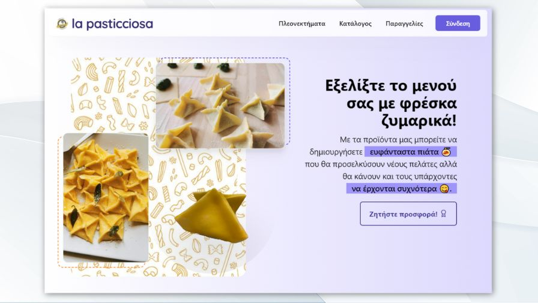
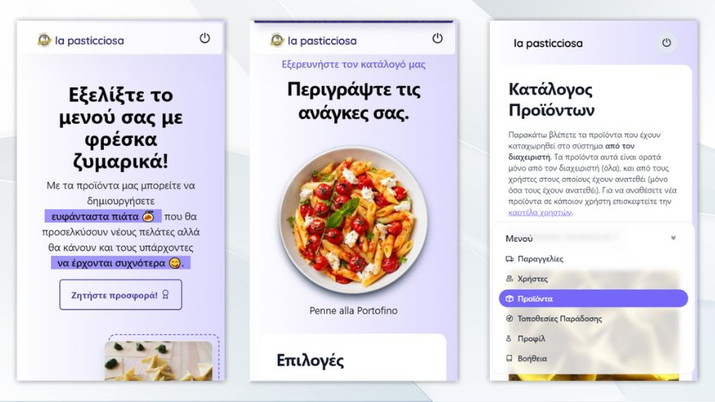
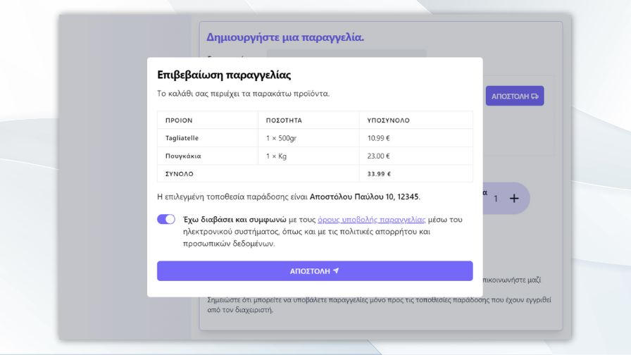

# Custom CRM for B2B eCommerce

Welcome to this fully-fledged Custom CRM for B2B companies! 🚀 This professional **production-ready** tool is actively utilized by the company that commissioned it. It's been designed and developed as s customized CRM platform for a fresh pasta company, featuring tailor-made customer acceptance procedures and custom UI elements for a succesfull and smooth transition from manual to online order placement.

## Features

1. **Client Vetting and Onboarding 🛡️**. Custom procedure for thorough client vetting and seamless onboarding.

2. **Dashboard 📊**. Fully developed dashboard for viewing, editing, and submitting orders.

3. **Authentication 🔒**. Secure authentication system to control access and ensure data integrity.

4. **Business Logic 🧠.** Robust business logic to streamline processes and enhance efficiency.

5. **Promotional Features 🌟**. Innovative promotional features to boost client engagement and satisfaction.

### Experimental Work-in-Progress Features

1. **3D Curated Landing Page 🌐**. Cutting-edge 3D landing page to provide a visually immersive user experience.

2. **Custom Chat System powered by Google's PaLM 💬**.Experimental chat system leveraging Google's PaLM for enhanced communication capabilities.

## Under the Hood

### a) Node.js Backend 🚂

- Built with Node.js and written in TypeScript.
- Utilizes tRPC for type-safe remote procedure calls.

### b) PostgreSQL Database 🐘

- Powered by CockroachDB for a scalable and resilient database solution.
- Deployed on Google Cloud Platform (GCP) via Firebase Functions.

### c) Vue.js 3 Frontend 🖌️

- Developed with Vue.js 3, XtendUI, and Tailwind CSS.
- Provides a modern and responsive user interface.

## Live Demo

Explore the live production version of the CRM [here](https://b2b.lapasticciosa.gr).

## Contact Information

For further inquiries or if you are interested in joining our development team, please feel free to reach out:

- **Email:** [theoanastasiadis98@gmail.com](mailto:theoanastasiadis98@gmail.com)
- **LinkedIn:** [Teo Anastasiadis](https://www.linkedin.com/in/teo-anastasiadis/)
- **Phone:** (+30) 6946605411

I appreciate your interest in my project and look forward to potential collaborations! 🌐🚀

## See More

- **[tRPC](https://github.com/trpc/trpc)** Move fast and break nothing.
  End-to-end typesafe APIs made easy.
- **[Spline](https://spline.design/)**, a place to design and colaborate in 3D
