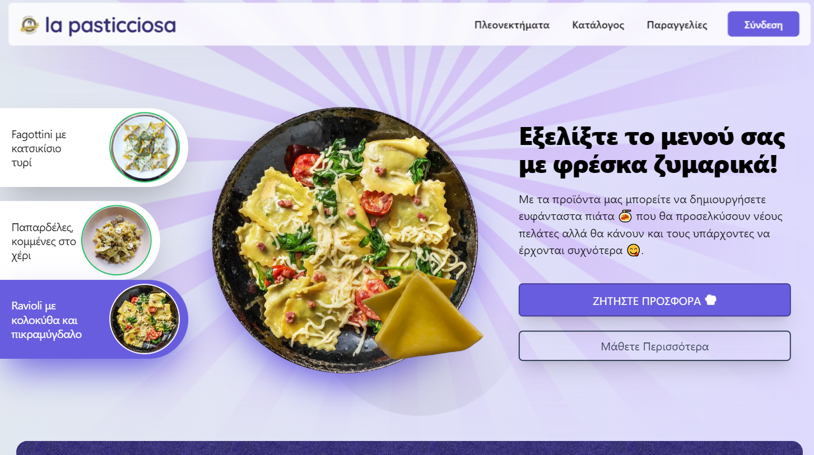
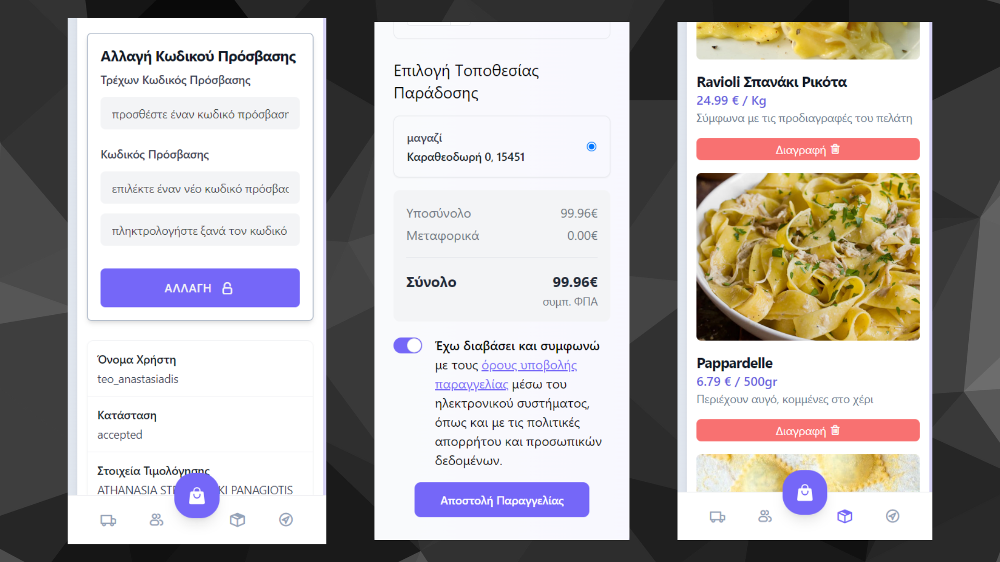
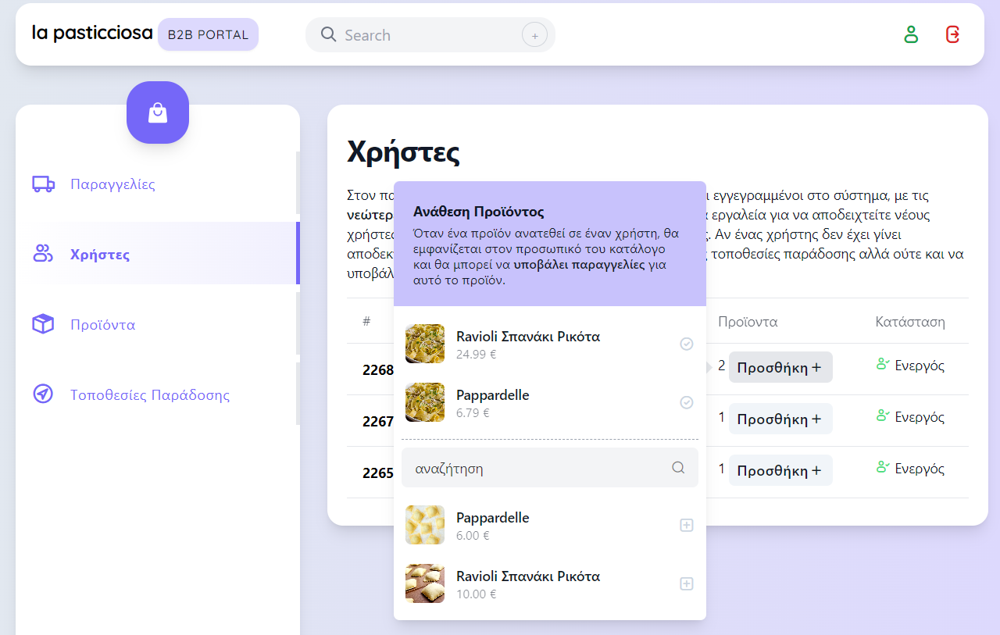
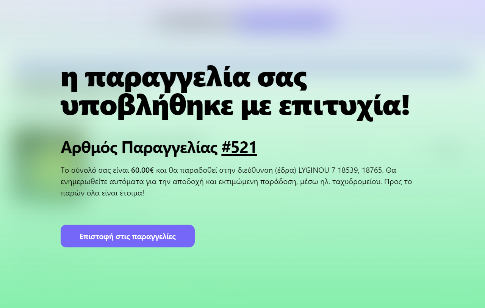

# Custom B2B Order Management System

Welcome to our Custom B2B Order Management System! This tool is currently in use and was specifically designed for a fresh pasta company, it offers tailored customer acceptance procedures and intuitive UI elements, facilitating a seamless transition from manual to online order placement.

## Features

1. **Client Vetting and Onboarding 🛡️**. Custom procedures ensure thorough client vetting and smooth onboarding experiences.

2. **Dashboard 📊**. Access a fully developed dashboard for order management, providing easy viewing, editing, and submission functionalities.

3. **Authentication 🔒**. A secure authentication system regulates access, guaranteeing data integrity.

4. **Business Logic 🧠**. Robust business logic is implemented to streamline operations and enhance efficiency.

5. **Promotional Features 🌟**. Innovative promotional tools are integrated to enhance client engagement and satisfaction.

### Experimental Work-in-Progress Features

1. **3D Enabled Landing Page 🌐**. Cutting-edge 3D landing page aims to provide a visually immersive user experience.

2. **Custom Chat System powered by Google's PaLM 💬**. Experimental chat system, leveraging Google's PaLM for enhanced communication capabilities.

## Under the Hood

### a) Node.js Backend 🚂

- Built with Node.js and written in TypeScript.
- Utilizes tRPC for type-safe remote procedure calls.

### b) PostgreSQL Database 🐘

- Powered by CockroachDB for scalability and resilience.
- Deployed on Google Cloud Platform (GCP) via Firebase Functions.

### c) Vue.js 3 Frontend 🖌️

- Developed with Vue.js 3, XtendUI, and Tailwind CSS.
- Offers a modern, responsive user interface.

## Live Demo

Explore the live production version of the B2B Order Management System here; [https://b2b.lapasticciosa.gr](https://b2b.lapasticciosa.gr).

## Contact Information

For further inquiries or if you are interested in joining our development team, please feel free to reach out:

- **Email:** [theoanastasiadis98@gmail.com](mailto:theoanastasiadis98@gmail.com)
- **LinkedIn:** [Teo Anastasiadis](https://www.linkedin.com/in/teo-anastasiadis/)
- **Phone:** (+30) 6946605411

Thank you for your interest in our project! We welcome potential collaborations and look forward to hearing from you.

## See More

- **[tRPC](https://github.com/trpc/trpc)**: Move fast and break nothing with end-to-end typesafe APIs.
- **[Spline](https://spline.design/)**: Explore Spline, a platform for designing and collaborating in 3D.
